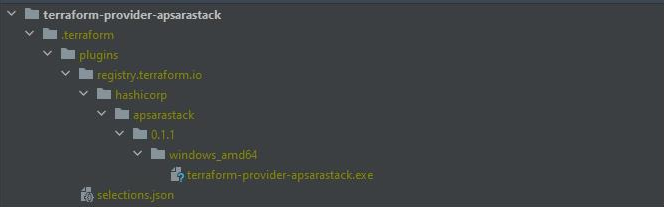

Steps to configure terraform and apsatrastack provider
==================

### Steps to install terraform on windows: for 0.12

-  To install Terraform, find the appropriate package for your system and download it.[0.12](https://releases.hashicorp.com/terraform/0.12.6/)
-  Terraform is packaged as a zip archive, So, after downloading Terraform, unzip the package.
-  Terraform runs as a single binary named terraform.
-  The final step is to make sure that the terraform binary is available on the PATH.
-  Finally verify the  installation of terraform with following command.
```        
terraform
terraform -v
```
    
### Steps to install terraform 0.13

-  To install Terraform, find the appropriate package for your system, and download it.[0.13](https://www.terraform.io/downloads.html)
-  Terraform is packaged as a zip archive, So, after downloading Terraform, unzip the package.
-  Terraform runs as a single binary named terraform. 
-  The final step is to make sure that the terraform binary is available on the PATH.
-  For your local use make a virtual source registry and paste the binary file as mentioned in the below image.
-  Finally verify the installation of terraform with the following command
```        
terraform
terraform -v
```


### Steps to Install Terraform in Linux
- Find the appropriate package for your system and download it.[0.12](https://releases.hashicorp.com/terraform/0.12.6/) or [0.13](https://www.terraform.io/downloads.html)
- Install unzip
```
$ sudo apt-get install unzip
```
3 Unzip and set path.
```
$ unzip  terraform_0.12.6_linux_amd64.zip 
$ sudo mv terraform /usr/local/bin/
```
### Steps to install terraform on Mac
- The easiest and quickest way to install Terraform is using Homebrew it will 
```
$ brew install terraform
```
- Or
Manually if the latest version is not ideal for your needs.
Download terraform for macos of  [0.12](https://releases.hashicorp.com/terraform/0.12.6/)


 **Note:**  Terraform is packaged as a zip archive, so after downloading Terraform, unzip the package. Terraform runs as a single binary named terraform. Any other files in the package can be safely removed and Terraform will still function
-  Extract files from the zip  
```
“$HOME/Downloads/terraform” for example.
```
-  The final step is to make sure that the terraform binary is available on the PATH.
-  Copy binary to a place in the path such as /usr/local/bin/terraform


### To download apsasrastack terraform provider


You can download the apsarastack terraform provider 
binary from [Github](https://github.com/Click2Cloud/terraform-provider-apsarastack/releases/tag/V0.6.6) , extract  and keep the binary on working directory for terraform  0.12+ and for terraform 0.13+ keep the binary at the location as mentioned above.

Using terraform:
- To Prepare your working directory for other commands:
```
terraform init
```
- Show changes required by the current configuration :
```
terraform plan
```
- To Create or update infrastructure :
```
terraform apply --auto-approve
```
- To destroy previously-created infrastructure :
```
terraform destroy --auto-approve
```

### Create the main.tf on working directory & add following portion to configure provider

````
 provider "apsarastack" {
  access_key = "ckhCs1K*********"
  secret_key = "2lY9uNh***********************"
  region =  "cn-xxxxxx-env00-d01"
  proxy = "http://100.1.1.1:5001"
  insecure = true
  resource_group_set_name= "ResourceSet(wzw)"
  domain = "server.asapi.cn-xxxxx-envXX-d01.intra.envXX.shuguang.com/asapi/v3"
  protocol = "HTTP"
}
````                                               
- Add following data in main.tf to create the resource vpc from terraform
```
resource "apsarastack_vpc" "default_vpc" {
  name       = "vpc-test"
  cidr_block = "172.16.0.0/12"
}
```
- Add following data in main.tf to create the resource ecs from terraform

````
variable "name" {
  default = "ecs-test"
}

data "apsarastack_instance_types" "default" {
  eni_amount        = 2
}
data "apsarastack_images" "default" {
  most_recent = true
  owners = "system"
}
resource "apsarastack_vpc" "default" {
  name = "${var.name}"
  cidr_block = "172.16.0.0/16"
}
resource "apsarastack_vswitch" "default" {
  vpc_id = "${apsarastack_vpc.default.id}"
  cidr_block = "172.16.0.0/16"
  availability_zone = "${data.apsarastack_instance_types.default.instance_types.0.availability_zones.0}"
  name = "${var.name}"
}
resource "apsarastack_security_group" "default" {
  name = "${var.name}"
  vpc_id = "${apsarastack_vpc.default.id}"
}
resource "apsarastack_instance" "default" {
  image_id = "${data.apsarastack_images.default.images.0.id}"
  instance_type = "${data.apsarastack_instance_types.default.instance_types.0.id}"
  instance_name = "${var.name}"
  internet_max_bandwidth_out = "10"
  security_groups = "${apsarastack_security_group.default.*.id}"
  availability_zone = "${data.apsarastack_instance_types.default.instance_types.0.availability_zones.0}"
  system_disk_category = "cloud_efficiency"
  vswitch_id = "${apsarastack_vswitch.default.id}"
}
````

